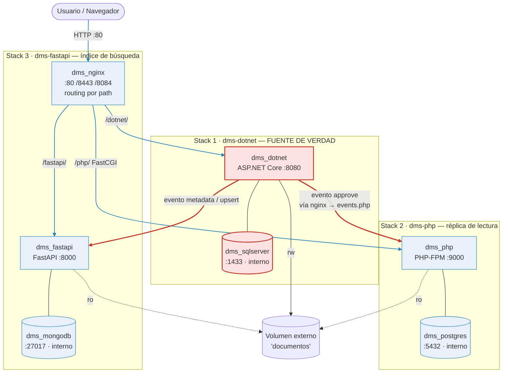
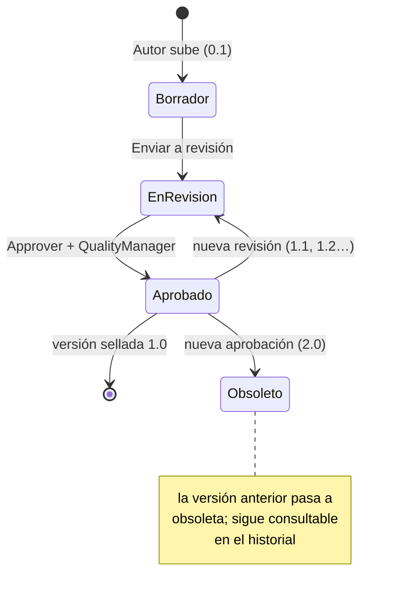
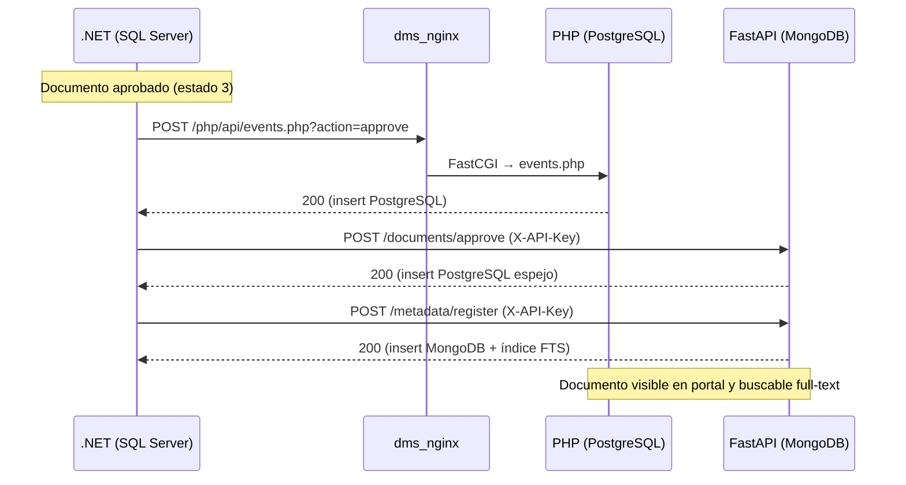

```
  ██████╗ ███╗   ███╗███████╗
  ██╔══██╗████╗ ████║██╔════╝
  ██║  ██║██╔████╔██║███████╗
  ██║  ██║██║╚██╔╝██║╚════██║
  ██████╔╝██║ ╚═╝ ██║███████║
  ╚═════╝ ╚═╝     ╚═╝╚══════╝
  Sistema Integral de Gestión Documental
  Enterprise Multi-Stack Platform · v2.1.0
```

# Sistema Integral de Gestión Documental

[](https://github.com/Ero-2/Sistema-Gestion-Documental)
[](#)
[](#)
[](#)
[](#)

Plataforma multi-stack para **gestión, aprobación y consulta pública** de documentos
normativos. Arquitectura **desacoplada y unidireccional**: .NET es la única fuente de
verdad y propaga eventos HTTP hacia PHP (portal público) y FastAPI (búsqueda). Ningún
sistema secundario toca SQL Server.

---

## Tabla de contenidos

- [Arquitectura](#arquitectura)
- [Servicios y puertos](#servicios-y-puertos)
- [Requisitos](#requisitos)
- [Instalación](#instalación)
- [Gestión de servicios](#gestión-de-servicios)
- [Stacks independientes](#stacks-independientes)
- [URLs](#urls)
- [Usuarios de prueba](#usuarios-de-prueba)
- [Modo Sandbox](#modo-sandbox)
- [Flujo de aprobación y versionado](#flujo-de-aprobación-y-versionado)
- [APIs](#apis)
- [Estructura del repositorio](#estructura-del-repositorio)
- [Documentación adicional](#documentación-adicional)

---

## Arquitectura

Tres `docker-compose` **independientes**, cada uno con su propio proyecto (`-p`), unidos
por una **red externa compartida** (`dms_backbone`) y un **volumen externo de documentos**.
Cada stack aísla su base de datos en una red interna privada. Un solo **Nginx** es el
punto de entrada y enruta **por path**.

**Desacoplada y unidireccional:** los eventos fluyen **solo** desde .NET hacia los
secundarios (flechas rojas). PHP y FastAPI **nunca** escriben en SQL Server ni llaman de
vuelta a .NET, y **no hay polling**. Si un secundario cae, .NET sigue siendo la fuente de
verdad. El ingreso de usuarios (flechas azules) es independiente del canal de eventos.



> Las flechas **rojas gruesas** = eventos (un solo sentido, .NET → secundarios). Las
> **azules** = tráfico de usuarios vía Nginx. No existe ninguna flecha de PHP/FastAPI hacia
> SQL Server: ese es el corazón del desacoplamiento.

- **`dms_backbone`** (bridge externa): única red por la que cruzan los stacks. La
  resolución cross-stack es por **container_name** (`dms_php`, `dms_dotnet`, etc.).
- **Nginx routing por path** (un solo host en `:80`):

  | Ruta | Destino | Mecanismo |
  |------|---------|-----------|
  | `/` | → `302 /php/` | redirect |
  | `/php/` | `dms_php:9000` (FastCGI) | strip prefix + `X-Forwarded-Prefix` |
  | `/dotnet/` | `dms_dotnet:8080` (+ SignalR) | strip + `X-Forwarded-Prefix` |
  | `/fastapi/` | `dms_fastapi:8000` | strip + `X-Forwarded-Prefix` |

  Cada app reconstruye sus enlaces con el prefijo recibido (.NET: `Request.PathBase`;
  FastAPI: `BASE` inyectado; PHP: `DMS_BASE`). Sin header (acceso directo) → sirve en raíz.

- **Volúmenes:**

  | Volumen | Tipo | Uso |
  |---------|------|-----|
  | `sqlserver_data` | nombrado | datos SQL Server |
  | `postgres_data` | nombrado | datos PostgreSQL |
  | `mongodb_data` | nombrado | datos MongoDB |
  | `indices_busqueda` | nombrado | cache/artefactos de búsqueda FastAPI |
  | `documentos` | **externo compartido** | archivos físicos: `.NET` r/w · `php`/`fastapi`/`nginx` r/o |

---

## Servicios y puertos

| Servicio | Tecnología | Puerto host | Interno | Notas |
|----------|------------|-------------|---------|-------|
| Nginx | Nginx (proxy + HTTPS) | `80`, `8443`, `8084` | 80/443/8084 | entrada única + routing por path |
| .NET | ASP.NET Core 10 | `5080` | 8080 | gestión interna (CalidadSYS) |
| PHP | PHP 8.3 (FPM) | — | 9000 | servido vía Nginx |
| FastAPI | Python 3.12 | `8001` | 8000 | búsqueda + APIs · Swagger `/docs` |
| SQL Server | SQL Server 2022 | `1435` | 1433 | fuente de verdad |
| PostgreSQL | PostgreSQL 16 | `5433` | 5432 | portal público |
| MongoDB | MongoDB 7 | `27018` | 27017 | índice full-text |

> Las BD se publican en `127.0.0.1` (solo localhost). Los puertos host son reasignables
> en `setup.ps1` si hay conflicto.

---

## Requisitos

- Docker Desktop 4.x o superior (con Docker Compose V2)
- Git
- 8 GB RAM disponibles

---

## Instalación

### Windows (PowerShell)

```powershell
git clone https://github.com/Ero-2/Sistema-Gestion-Documental.git
cd Sistema-Gestion-Documental
.\setup.ps1
```

El instalador pregunta:

1. **Modo de instalación:**
   - `[1] Sandbox` — genera 10,000 documentos de prueba automáticamente
   - `[2] Development` — sistema limpio, sin documentos
2. **Contraseña maestra** para SQL Server, PostgreSQL y MongoDB
   - Mínimo 8 caracteres, mayúscula, minúscula, dígito y carácter especial (ej. `MiPass1!`)

Si detecta un puerto ocupado, ofrece **reasignarlo** automáticamente y lo persiste en `.env`.
Si el sistema ya está instalado, abre el **menú de gestión** (ver abajo).

### Linux / macOS / WSL

```bash
git clone https://github.com/Ero-2/Sistema-Gestion-Documental.git
cd Sistema-Gestion-Documental
bash install.sh
```

Opciones:

```bash
bash install.sh --force      # sobreescribe .env sin preguntar
bash install.sh --no-build   # usa imágenes cacheadas
bash install.sh --dotnet     # solo un stack (--dotnet | --php | --fastapi)
```

`install.sh` también soporta los mismos subcomandos de ciclo de vida que `setup.ps1`
(ver [Gestión de servicios](#gestión-de-servicios)). El **menú interactivo** de gestión
es exclusivo de `setup.ps1` (Windows).

---

## Gestión de servicios

`setup.ps1` (Windows) e `install.sh` (Linux/macOS) incluyen subcomandos no interactivos
para administrar el ciclo de vida. Aceptan selección de stack
(`-Stack dotnet|php|fastapi` en PowerShell; `--dotnet|--php|--fastapi` en bash);
por defecto aplican a los 3.

| Acción | Windows | Linux/macOS | Docker | Efecto |
|--------|---------|-------------|--------|--------|
| Encender | `.\setup.ps1 up` | `bash install.sh up` | `up -d` | enciende (crea si faltan) |
| Apagar | `.\setup.ps1 down` | `bash install.sh down` | `stop` | **apaga** — conserva contenedores y datos |
| Reiniciar | `.\setup.ps1 restart` | `bash install.sh restart` | `restart` | reinicia |
| Reinstalar | `.\setup.ps1 reinstall` | `bash install.sh reinstall` | `up -d --build --force-recreate` | rebuild + recrea, **conserva datos** |
| Estado | `.\setup.ps1 status` | `bash install.sh status` | `ps` | estado de contenedores |
| Logs | `.\setup.ps1 logs` | `bash install.sh logs` | `logs` | últimas líneas por contenedor |
| Puertos | `.\setup.ps1 ports` | — | — | puertos del sistema (libre/ocupado) |
| Validar | `.\setup.ps1 validate` | — | — | HTTP + BD + storage + motor de búsqueda |

Alias: `start`→`up`, `stop`→`down`, `rebuild`→`reinstall`.

### Menú de gestión interactivo

Al correr `.\setup.ps1` con el sistema ya instalado (o `.\setup.ps1 -Diagnose`), aparece
un menú en bucle que **re-lee el estado real en cada vuelta**:

```
  GESTION DEL SISTEMA
  Contenedores DMS  (encendidos: 7 / 7):
    dms_nginx        [running]
    ...
  [U]  Encender (up)
  [P]  Apagar (stop -- conserva contenedores y datos)
  [R]  Reiniciar (restart)
  [I]  Reinstalar (rebuild + recrea, conserva datos)
  [L]  Reinicializar limpio (elimina volumenes, rebuild)
  [D]  Menu de diagnostico
  [S]  Salir
```

- Tras **apagar**, el menú reaparece para que puedas **encender** de nuevo.
- Avisa con condicionales si ya están arriba/abajo o si no hay nada que reiniciar.
- `[L]` es el único que **borra volúmenes de datos** (pide confirmación). El volumen
  externo `documentos` **no** se elimina.

---

## Stacks independientes

Cada sistema puede levantarse por separado:

```powershell
.\setup.ps1 -Stack dotnet     # .NET + SQL Server   (alias legacy: net)
.\setup.ps1 -Stack php        # PHP + PostgreSQL
.\setup.ps1 -Stack fastapi    # FastAPI + MongoDB + Nginx  (alias legacy: indexer)
```

```bash
# Linux (docker compose directo)
docker network create dms_backbone        # infra compartida (una vez)
docker volume create documentos

docker compose -p dms-dotnet  -f docker-compose.dotnet.yml  --env-file .env up -d --build
docker compose -p dms-php     -f docker-compose.php.yml     --env-file .env up -d --build
docker compose -p dms-fastapi -f docker-compose.fastapi.yml --env-file .env up -d --build

# Detener un stack (conserva datos)
docker compose -p dms-php -f docker-compose.php.yml stop
```

Cada stack tiene su red interna privada (`net_internal` / `php_internal` /
`indexer_internal`) y se comunica con el resto por la red compartida `dms_backbone`.

---

## URLs

### Punto de entrada único (Nginx :80, routing por path)

| Portal | URL |
|--------|-----|
| Portal público (PHP) | http://localhost/php/ |
| Gestión interna (.NET) | http://localhost/dotnet/ |
| Motor de búsqueda (FastAPI) | http://localhost/fastapi/ |
| Raíz | http://localhost → `302 /php/` |

### Acceso directo (debug)

| Servicio | URL |
|----------|-----|
| .NET directo | http://localhost:5080 |
| .NET vía Nginx | http://localhost:8084 |
| FastAPI Swagger | http://localhost:8001/docs |
| FastAPI HTTPS | https://localhost:8443 |

---

## Usuarios de prueba

Todos comparten la contraseña ingresada en la instalación
(`Calidad#2026Dev` si se usó el seeder directamente).

| Rol | Email | Empresa |
|-----|-------|---------|
| SuperAdmin | super@qualitydms.local | Global |
| Admin | admin@qualitydms.local | ACME |
| AdminEmpresa | adminempresa@qualitydms.local | ACME |
| QualityManager | calidad@qualitydms.local | ACME |
| Approver | aprobador1@qualitydms.local | ACME |
| Approver | aprobador2@qualitydms.local | ACME |
| Author | autor@qualitydms.local | ACME |
| Viewer | lector@qualitydms.local | ACME |
| AdminEmpresa | admin.beta@qualitydms.local | BETA |

> Sistema **multiempresa**: SuperAdmin ve todo; AdminEmpresa solo su empresa
> (aislamiento por `CompanyId` con EF query filters).

---

## Modo Sandbox

Al elegir **Sandbox** en el instalador, el sistema genera automáticamente:

- **10,000 documentos** en SQL Server con datos realistas (Bogus en español)
- **7,000 aprobados** propagados a PostgreSQL y MongoDB vía las APIs reales
- **2,000 en revisión** y **1,000 borradores** solo en SQL Server

La propagación usa 50 llamadas concurrentes a las mismas APIs de eventos que el flujo
real. Tarda ~5 minutos en el primer arranque.

---

## Flujo de aprobación y versionado



Al sellar una versión, .NET dispara los eventos hacia los stacks secundarios:



Las APIs son **independientes**: un error en una no bloquea la otra.

---

## APIs

Todas las APIs viven en el servicio **FastAPI**.

- **Externo (host):** `http://localhost:8001`
- **Interno (red `dms_backbone`):** `http://dms_fastapi:8000`
- **Swagger UI:** http://localhost:8001/docs

### Autenticación

Las rutas de integración requieren el header **`X-API-Key`** (valor en `.env` →
`FASTAPI_API_KEY`). Rutas públicas exentas: `/`, `/health`, `/docs`, `/openapi.json`,
`/search`, `/search/documents`, `/auth/*`, `/indexer/file/*`, `/indexer/viewer/*`,
`/indexer/download/*`.

```bash
curl -X POST http://localhost:8001/documents/approve \
  -H "X-API-Key: $FASTAPI_API_KEY" \
  -H "Content-Type: application/json" \
  -d '{ "document_id": 1, "code": "DOC-001", "title": "Política", "version": "1.0", "file_url": "/uploads/doc-1.pdf" }'
```

### Documents Sync — `/documents` → PostgreSQL

| Método | Ruta | Descripción |
|--------|------|-------------|
| POST | `/documents/approve` | inserta documento aprobado |
| POST | `/documents/update` | actualiza estado / vigencia |
| POST | `/documents/version` | registra nueva versión |
| POST | `/documents/obsolete` | marca como obsoleto |

<details><summary>Payload <code>/documents/approve</code></summary>

```json
{
  "document_id": 123,
  "code": "DOC-2024-001",
  "title": "Política de Calidad",
  "category_id": 1,
  "category_name": "Políticas",
  "department_id": 2,
  "department_name": "Calidad",
  "version": "1.0",
  "file_url": "/uploads/2024/doc-123-v1.pdf",
  "effective_date": "2024-01-15T10:00:00Z",
  "expiration_date": "2025-01-15T10:00:00Z"
}
```
</details>

### Metadata Sync — `/metadata` → MongoDB

| Método | Ruta | Descripción |
|--------|------|-------------|
| POST | `/metadata/register` | registra metadatos (al aprobar) |
| POST | `/metadata/update` | actualiza metadatos |
| POST | `/metadata/history` | añade evento al historial |
| GET | `/metadata/history/{postgres_id}` | historial completo |

<details><summary>Payload <code>/metadata/register</code></summary>

```json
{
  "postgres_id": 123,
  "code": "DOC-2024-001",
  "title": "Política de Calidad",
  "category_name": "Políticas",
  "department_name": "Calidad",
  "file_url": "/uploads/2024/doc-123-v1.pdf",
  "version": "1.0"
}
```
</details>

### Indexer — `/indexer` (indexación + archivos)

| Método | Ruta | Descripción | Auth |
|--------|------|-------------|------|
| POST | `/indexer/upsert` | inserta/actualiza doc + extrae texto | X-API-Key |
| POST | `/indexer/obsolete` | retira del índice | X-API-Key |
| GET | `/indexer/search` | búsqueda interna | X-API-Key |
| GET | `/indexer/file/{name}` | sirve el archivo físico | pública |
| GET | `/indexer/download/{name}` | descarga | pública |
| GET | `/indexer/viewer/{name}` | visor HTML | pública |
| GET | `/indexer/content/{name}` | texto extraído | X-API-Key |

### Search — búsqueda reutilizable (consumida por .NET y PHP)

| Método | Ruta | Descripción |
|--------|------|-------------|
| GET | `/search/documents` | API JSON full-text + filtro empresa |
| GET | `/search` | UI HTML de búsqueda |

Parámetros de `/search/documents`:

| Param | Tipo | Default | Descripción |
|-------|------|---------|-------------|
| `q` | string | — | término (>=2 chars → full-text; vacío → todos) |
| `company_id` | int | — | aislamiento multiempresa |
| `status` | string | `active` | `active` \| `obsolete` \| `all` |
| `limit` | int | `100` | tamaño de página (1–500) |
| `offset` | int | `0` | desplazamiento (paginación) |

```bash
curl "http://localhost:8001/search/documents?q=calidad&company_id=1&status=active&limit=20"
```

### Auth y Admin

| Método | Ruta | Descripción |
|--------|------|-------------|
| POST | `/auth/login` | login (JSON) |
| GET | `/auth/me` | usuario actual |
| GET | `/admin/stats` | métricas del índice |
| GET | `/admin/docs` | listado admin |
| GET | `/admin/viewer` | visor admin (HTML) |
| GET | `/health` | healthcheck |

> Documentación detallada de payloads, manejo de errores y ejemplos .NET/curl en
> [`API_INTEGRATION.md`](API_INTEGRATION.md).

---

## Estructura del repositorio

```
/
├── docker-compose.dotnet.yml    ← Stack 1: .NET + SQL Server
├── docker-compose.php.yml       ← Stack 2: PHP + PostgreSQL
├── docker-compose.fastapi.yml   ← Stack 3: FastAPI + MongoDB + Nginx
├── compose-all.legacy.yml       ← Monolito anterior (respaldo, no se ejecuta)
├── setup.ps1                    ← Instalador + gestión (Windows PowerShell)
├── install.sh                   ← Instalador (Linux/macOS/WSL)
├── scripts/                     ← Módulos del instalador
├── src/
│   ├── dotnet-core/             ← CalidadSYS (ASP.NET Core) — fuente de verdad
│   ├── php-app/                 ← PublicDMS (PHP) — portal público
│   └── python-service/          ← Motor de búsqueda + APIs (FastAPI)
│       ├── main.py              ← app + middleware X-API-Key + índices Mongo
│       └── routes/              ← documents_sync · metadata_sync · indexer · search · auth · admin
├── db/
│   ├── postgres/                ← Schema PostgreSQL
│   └── mongo/                   ← Init MongoDB
├── docker/
│   ├── dotnet-core/  php-app/  python-service/   ← Dockerfiles
│   └── nginx/                   ← Dockerfile + nginx.conf (routing por path)
└── storage/                     ← (montaje local de documentos)
```

---

## Documentación adicional

| Documento | Contenido |
|-----------|-----------|
| [`ARQUITECTURA_DOCKER.md`](ARQUITECTURA_DOCKER.md) | refactor a 3 stacks: redes, volúmenes, wiring por container name, riesgos |
| [`API_INTEGRATION.md`](API_INTEGRATION.md) | detalle de payloads, errores y ejemplos de cliente .NET |
